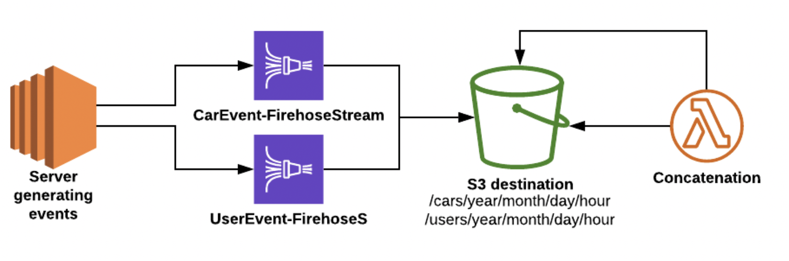

# Handling event data with AWS Firehose 

## Description
This prototype demonstrates how to handle event data generated by a server. 
Several event types are considered, i.e. with different schema (cars and users). 

## Implementation
We use a `firehose_publisher` to produce 2 different types of event data. 
Each event is pushed to its own firehose delivery stream that will end up in an s3 bucket, the main reason being 
that its event type has a different schema. 

Firehose is an AWS Kinesis technology offering the following features: 
- batching of many records into a single file 
- compression 
- conversion to other formats 
- use of a lambda function to do in-line processing of the data before it get sent to its destination. 

The different events are stored along a prefix describing their nature and the default partition of Firehose, 
i.e. `year/month/day/hour`. The infrastructure is created using Terraform.

## How to run
`terraform init`

`terraform apply -auto-approve`

`python firehose_publisher.py` 